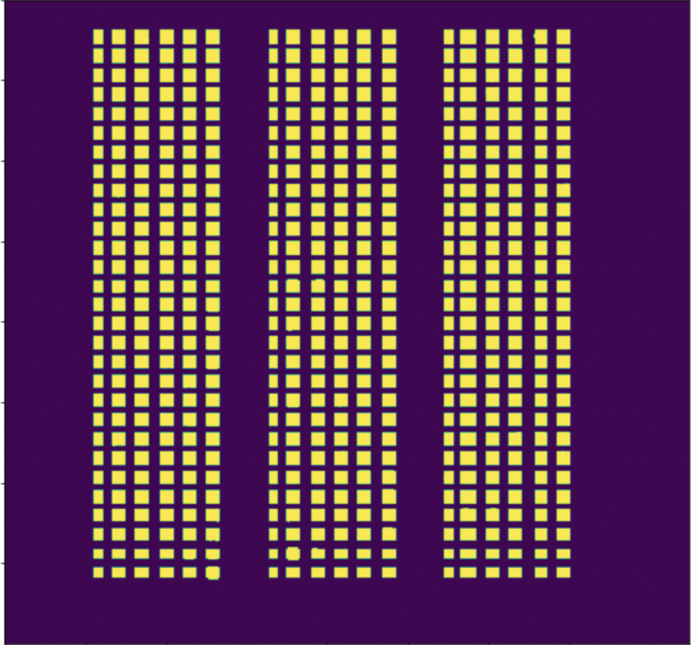
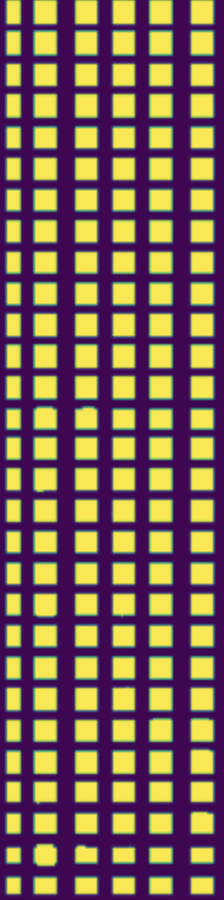
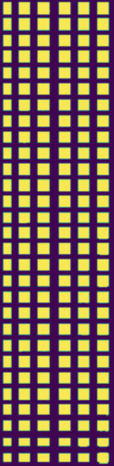
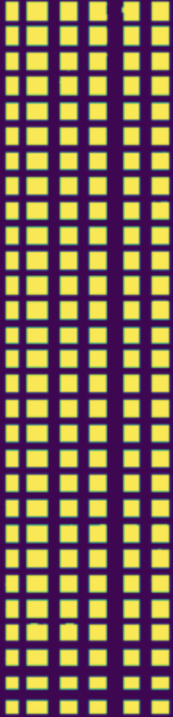
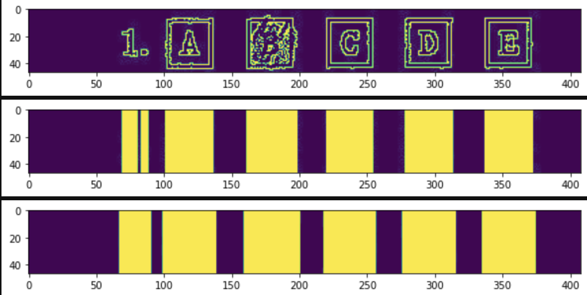
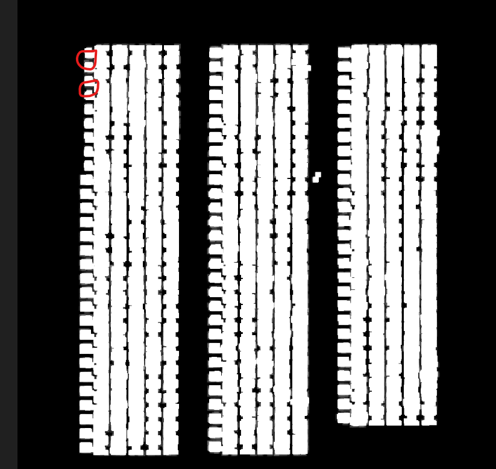
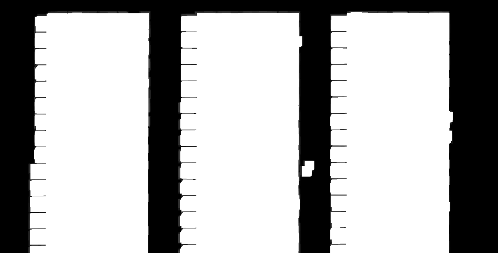
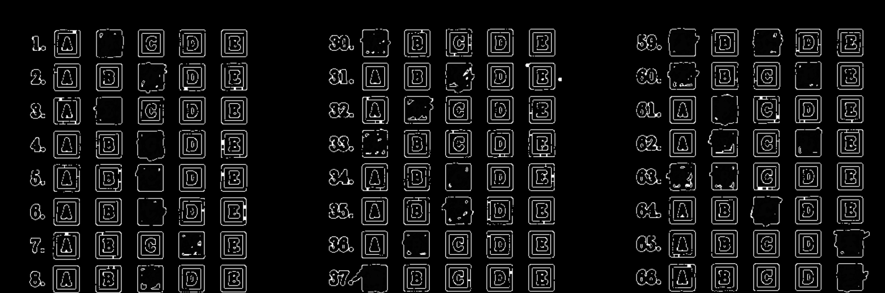
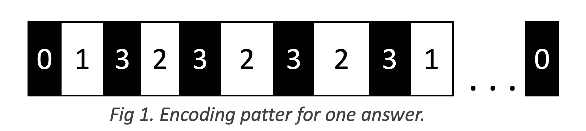
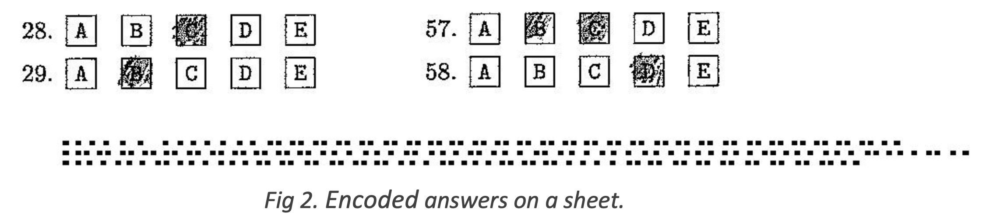

# Assignment A1 - Image Processing and Recognition Basics


## Instructions to run:
Part 1: Grading

```
python3 grade.py form.jpg output.txt
```
* form.jpg - Answer sheet image
* output.txt - output text file containing option selected by the student for each question.

Part 2: Inject and Extract

```
python3 inject.py form.jpg answers.txt injected.jpg
python3 extract.py injected.jpg output.txt
```
* form.jpg -  Answer sheet image.
* answers.txt - text file containing the answers to be encoded.
* injected.jpg - image file with answers injected.
* output.txt - text file containing the answers extracted from the injected.jpg


# Introduction
In this project we aim to use computer vision for image processing and recognition to grade a multi choice answer sheet. To grade, we extracted the selected choices using a various filter from PILLOW library to segregate the choices and used convolution to find the activation based on the selection. We also encoded the ground truth (the answers) onto the sheet as a combination of black and white boxes to keep grading process simple while completely hiding the answers from the students.


# Method
This section has two parts. **Part 1** describes the workings of grading mechanism and **Part 2** shows how ground truths are embedded in the answers sheet to later extract them.

## Part 1 - Grading an answer sheet.
**Approach**
- We first ran edge detection on the answer sheet to detect all the edges of the boxes. 
- Next, we ran a 1D convolution with a filters of all ones, in both vertical and horizontal directions, applied erosion and dilation on both the outputs
- Took the intersection of both these images. The output was as follows (used image below 600 pixels as in all the example cases, the question boxes started below 675, so 600 seemed to be a safe point to slice and thus save compute time):


From the figure above, we generated, the row number(coordinate) of each question. we also extracted the column coordinates for the start and end points for each section.
For generating row co-ordinates, we first iterated through the image from top left corner and stop at a point where we find a pixel with value = 255, which gives the top right coordinates for the first section. Next, from that top left point, we interate downwards the image, and pick the starting points of all the rows.

Next we sliced the sheet into three sections using the start and end point column coordinates. The separated sections looks like below:
Section 1             |  Section 2             |  Section 3                |
:-------------------------:|:-------------------------:|:-------------------------:
  |    |  

Now for each section we iterate row wise using the row coordinates generated in the previous step. Here using the row coordinates, we extract question rows from the original image in grayscale. For each extracted row, we apply a 1D convolution to generate blobs.
Here is an example:
row sample             |
:-------------------------:
  

In the figure above, the first row represent the gray scale question fragment extracted from the original image. The second row represents the output after applying 1D convolution with filter containing all ones. The last row represent the final blobs after applying the dilation.

In the row sample image above, the blobs from left represent Answer_scribbling(if any),Qno,A,B,C,D,and E

For each row, we apply the above mentioned preprocessing, and generate blob coordinates for all the blobs detected. Then check the pixel intensities in all the blobs. Applied a threshold on the pixel intensity summation to detect if the option is selected or not.

Finally, the output is written to output.txt file.

This is the final approach we used in our submission. It performs well on all the test images. It can handle a rotation upto `0.2` degrees robustly. The accuracy gradually decreases with increase in the angle.

<br>

## Other approaches that were tested

### 1 Hough transform
We first thought of using hough transform to find the alignment of the page before beginning any processing on it. After applying the sobel filters and calculating the rho and theta values we were able to generate a straight line hough transform image in the hough space. After converting the image from Hough transform image to a normal image we noticed the horizontal lines overlapping over one other and decided to drop this approach.

### 2 Segmentation using pixel coordinates
First we apply the horizontal edge filter to the image using the kernel [-1, -1, -1, 2, 2, 2, -1, -1, -1]
This gives us the image that can be found in  The markings in the red can help distinguish between two different question numbers. We then iterate through each column and find the row where the first non zero pixel occurs. This gives us the starting point, (x,y) pixel of the first question.
```python
#Find starting point
x_cood = 0
y_cood = 0
for col in range(horizontal_data.shape[1]):
    found = 0
    for row in range(0, horizontal_data.shape[0]-1300): #Check only the first quarter of the image
        if horizontal_data[row][col] > 0.:
            x_cood=row
            y_cood=col
            found =1 
            break
    if found ==1:
        break
print(x_cood, y_cood)
```
Next we apply a vertical edge filter to the image using the kernel [0, 1, 2, -1, 0, 1, -2, -1, 0]. This gives us the image that can be found in . We then start from the starting point obtained in the previous step and iterate through columns to find the starting points,  (x,y) pixel of each column.
Once we have the coordinates of both the rows and columns we iterated from the beginning of the image to the end and gathered the snippets of all the questions. 
Below are the functions used to do implement the discussed idea.

```python 
#Find (x, y) coordinates of starting of left hand side of each question block
start = x_cood
def x_cood_calculator(x_cood, y_cood, start):
    q_cood = []
    while(horizontal_data[x_cood][y_cood] != 0):
        x_cood +=1
        if horizontal_data[x_cood][y_cood] == 0:
            q_cood.append(((start, y_cood), (x_cood, y_cood)))
            while(horizontal_data[x_cood][y_cood] == 0):
                x_cood +=1
                if x_cood== horizontal_data.shape[0]-25:
                    return q_cood
            start = x_cood
        if x_cood== horizontal_data.shape[0]-25:
            return q_cood
```
```python
#Find (x,y) coordinates of ending of right hand side of each question block
def y_cood_calculator(x_cood, y_cood, start):
    y_qcood = []
    while(vertical_im_data[x_cood][y_cood] != 0):
        y_cood +=1
        if vertical_im_data[x_cood][y_cood] == 0:
            y_qcood.append(((x_cood, start), (x_cood, y_cood)))
            while(vertical_im_data[x_cood][y_cood] == 0):
                y_cood +=1
                if y_cood== vertical_im_data.shape[1]-25:
                    return y_qcood
            start = y_cood
        if y_cood== vertical_im_data.shape[1]-25:
            return y_qcood
```
Added extra padding to the coordinates to obtain the images using the below function. Images list contains all the images in order from 1 to 85.
```python
images = []
def image_collection(q_cood, y_qcood, images, cropped):
    q_count = len(q_cood)
    for i in range(q_count):
        top_left_x = q_cood[i][0][0]-7
        top_left_y = q_cood[0][0][1]-35
        top_right_y = y_qcood[0][1][1]+2
        bottom_right_x = q_cood[i][1][0]+6
        area=(top_left_y, top_left_x, top_right_y, bottom_right_x)
        cropped1 = cropped.crop(area)
        images.append(cropped1)
```

### 3 Image segmentation using K-Mean
We also tried to use K-Mean clustring for image segmentation. Idea was to segment the answer sheet into segments that would each corresponds to unique checkboxes. Then use the cluster labels to identify those boxes and use cross correlation to find the filled in boxes vs empty.
We ran into issue where using a cluster label was not activating a unique box. For example, we picked up a random cluster and set the pixel value for that cluster to 255 and notice that it activated various checkboxes. Below is segmented image with k=6.




<br> 

## Part 2 - Injecting and Extracting answers
To inject answers, the team considered Steganography and working in the Fourier space. But soon we realized neither of those method would work if we wanted to retain the answers even after the injected page is printed and scanned. The solution needed to be visible on the sheet.

We decided to encode the answers and present them as a small box at the bottom of the answers sheet. And apply the encoding process in reverse to decode them.

Process of encoding is simple, we assigned a numerical value to each of the possible options (A, B, C, D, and E) and to value `x`. 
For each line in the answers text file, we gathered number of answers, each separated by constant space (delimiter) of 6 pixel. 
The length of encoding is directly proportional to number of checkboxes selected. To make sure answers are fitted well in a line, we chose to divide them in three lines. One for each column on the answer sheet.


The pattern for encoding is shown in Fig 1.
- 0: Start and stop of the encoding
- 1: Stores the number of answers. E.g., 3 pixels if one checkbox is selected, 6 pixels if 2 checkboxes and so on.
- 2: Stores a unique predefined number of pixels for options A, B, C, D, E and x. 
- 3: Acts as separator between values.




Fig 2 shows the encoded answers on an answer sheet.




## Improvements
1. Our solution can be improved by implementing Hough trasform to find the alignment of the page so that it can give us the right output even if the page has been tilted during scanning. We tested the image with a certain percentage of tilt and it works accurately on some of the test images.
2. A more generic approach could have been taken to find solutions for any type of paper format that may be provied. For eg., Options with circled edges.

<br>

## Contributions of the Authors
All three team members demonstrated great team work. We collaborated at least 3-4 times a week over a zoom call while keeping everyone updated with any issue or success over the slack channel. The approach was unanimously agreed upon after a several POCs by each team member.

Sripad - 
Sripad worked on the quick POC for grading the paper and steganography. Implemented image segmentation and edge detection. Worked with 1D convolution filters for blob detection <br>
Niket - Niket worked on the POC for grading the paper. Implemented hough transform, and image segmentation using edge detection kernels. <br>
Pankaj - Pankaj worked on the POC for grading the paper followed coding part for injecting and extracting the answer on a form.
<br>
All the members are responsible for running the experiments (testing/validation) on all the parts of this assignment.
